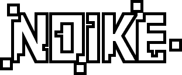

<a name="readme-top"></a>
<div align="center">
	<a href="./LICENSE">
		
	</a>
	<a href="https://github.com/LordOfTrident/noike/graphs/contributors">
		
	</a>
	<a href="https://github.com/LordOfTrident/noike/stargazers">
		
	</a>
	<a href="https://github.com/LordOfTrident/noike/issues">
		
	</a>
	<a href="https://github.com/LordOfTrident/noike/pulls">
		
	</a>
	<br><br><br>
	
	<h1 align="center">Noike</h1>
	<p align="center">🐍 A "weird POV effect" noise snake game ⬜⬛</p>
	<p align="center">
		<a href="#demo">View Demo</a>
		·
		<a href="https://github.com/LordOfTrident/noike/issues">Report Bug</a>
		·
		<a href="https://github.com/LordOfTrident/noike/issues">Request Feature</a>
	</p>
	<br>
</div>

<details>
	<summary>Table of contents</summary>
	<ul>
		<li><a href="#introduction">Introduction</a></li>
		<li><a href="#demo">Demo</a></li>
		<li>
			<a href="#pre-requisites">Compiling</a>
			<ul>
				<li>
					<a href="#pre-requisites">Pre-requisites</a>
					<ul>
						<li><a href="#debian">Debian</a></li>
						<li><a href="#arch">Arch</a></li>
					</ul>
				</li>
				<li><a href="#debian">Quickstart</a></li>
			</ul>
		</li>
		<li><a href="#bugs">Bugs</a></li>
	</ul>
</details>

## Introduction
A snake game in C using SDL2 inspired by the ["Weird POV Effect"](https://youtu.be/TdTMeNXCnTs)
video on Youtube. The name "Noike" stands for NOIse snaKE.

The idea is essentially that you create an illusion of a moving shape by flipping pixels on a noise
filled canvas, but when you pause the video of the moving shape, you can clearly see there is
nothing there.

Play this video and pause at any point:

https://github.com/LordOfTrident/noike/assets/80625541/2ee2e14c-4613-434f-87ca-7635c1173f2c

## Demo
https://github.com/LordOfTrident/noike/assets/80625541/ce8d2de1-6631-44f5-a6f8-bd85f8fe4fd3

## Compiling
### Pre-requisites
Noike requires the following dependencies to be installed globally to compile:
- [SDL2](https://github.com/libsdl-org/SDL)
- [SDL2/SDL_image](https://github.com/libsdl-org/SDL_image)
- [SDL2/SDL_mixer](https://github.com/libsdl-org/SDL_mixer)

#### Debian
```
$ apt install libsdl2-dev libsdl2-image-dev libsdl2-mixer-dev
```

#### Arch
```
$ pacman -S sdl2 sdl2_image sdl2_mixer
```

### Quickstart
```sh
$ git clone https://github.com/LordOfTrident/noike
$ cd noike
$ make
$ ./noike
```

## Bugs
If you find any bugs, please, [create an issue and report them](https://github.com/LordOfTrident/noike/issues).

<br>
<h1></h1>
<br>

<div align="center">
	<a href="https://en.wikipedia.org/wiki/C_(programming_language)">
		
	</a>
	<a href="https://www.libsdl.org/">
		
	</a>
	<p align="center">Made with ❤️ love</p>
</div>

<p align="right">(<a href="#readme-top">Back to top</a>)</p>
